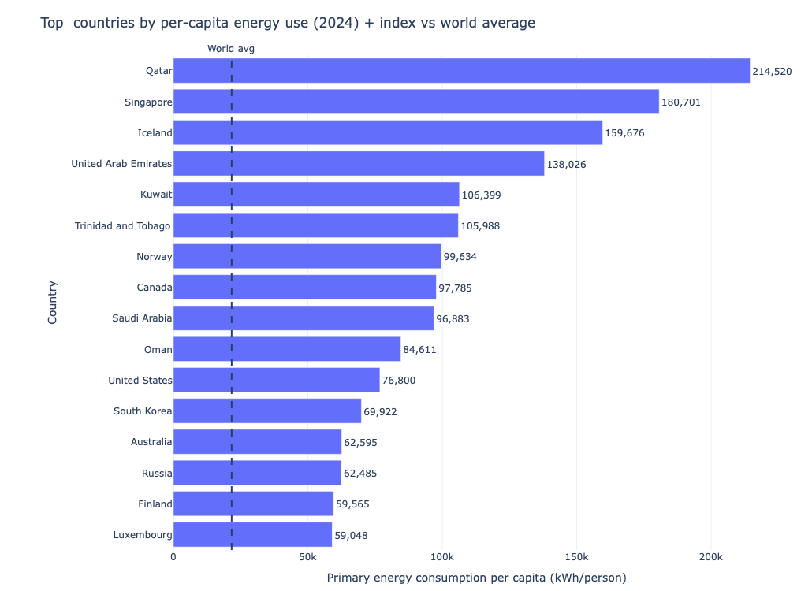
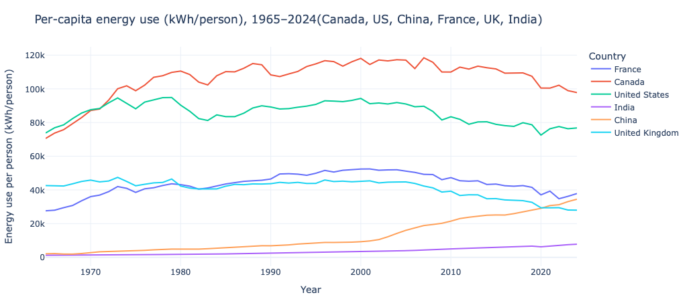
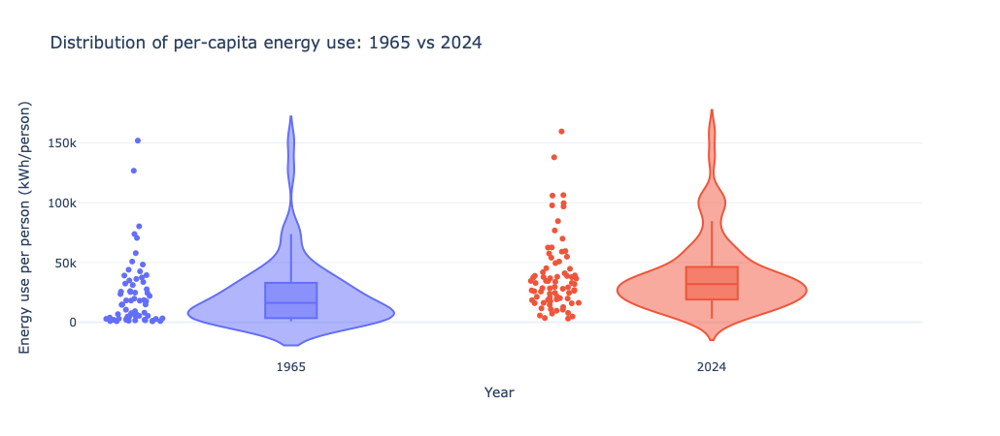
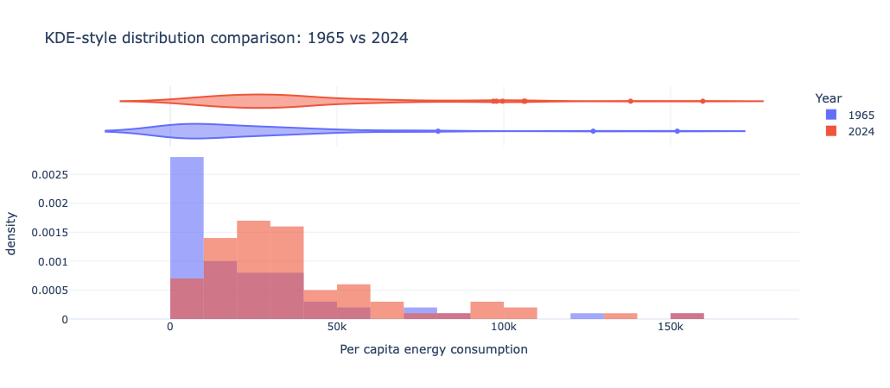
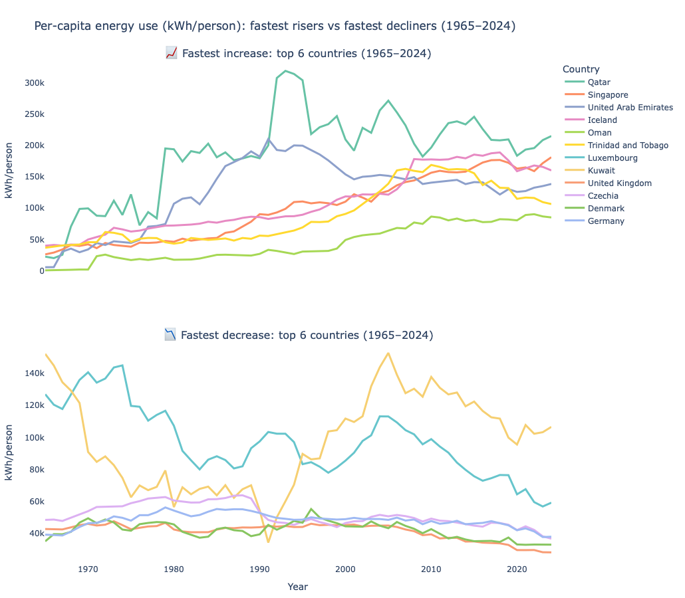
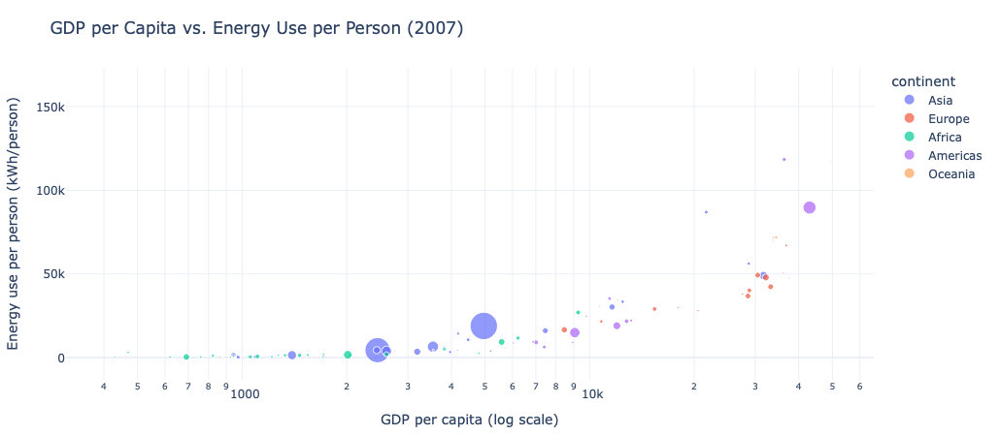
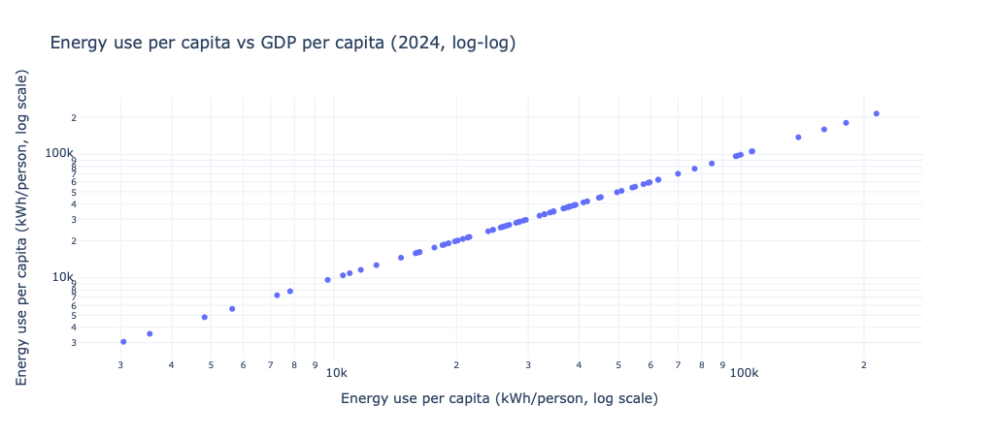
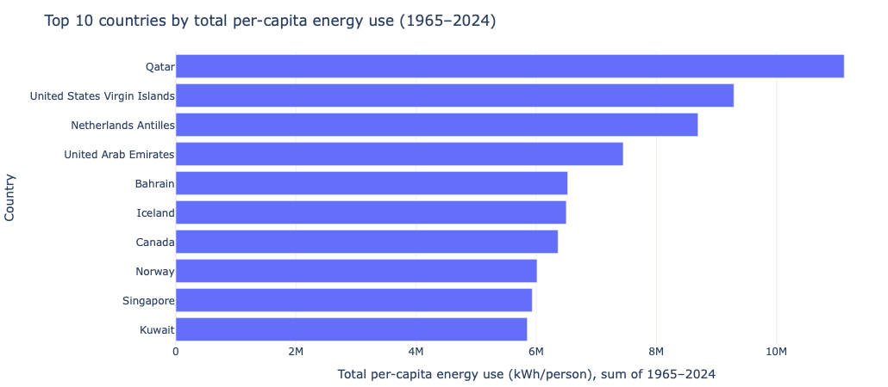
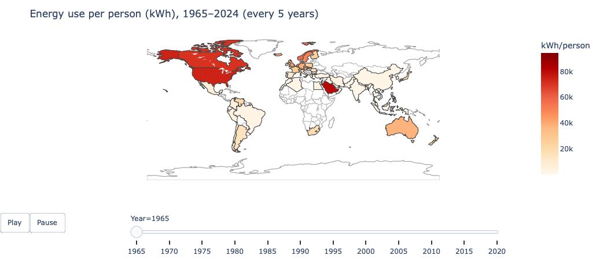

Xixi Lin_Data Visualization_Per-capita_Energy_Use


```python
#step 1 install plotly

%pip install plotly nbformat
```

    Requirement already satisfied: plotly in /opt/anaconda3/lib/python3.13/site-packages (5.24.1)
    Requirement already satisfied: nbformat in /opt/anaconda3/lib/python3.13/site-packages (5.10.4)
    Requirement already satisfied: tenacity>=6.2.0 in /opt/anaconda3/lib/python3.13/site-packages (from plotly) (9.0.0)
    Requirement already satisfied: packaging in /opt/anaconda3/lib/python3.13/site-packages (from plotly) (24.2)
    Requirement already satisfied: fastjsonschema>=2.15 in /opt/anaconda3/lib/python3.13/site-packages (from nbformat) (2.20.0)
    Requirement already satisfied: jsonschema>=2.6 in /opt/anaconda3/lib/python3.13/site-packages (from nbformat) (4.23.0)
    Requirement already satisfied: jupyter-core!=5.0.*,>=4.12 in /opt/anaconda3/lib/python3.13/site-packages (from nbformat) (5.7.2)
    Requirement already satisfied: traitlets>=5.1 in /opt/anaconda3/lib/python3.13/site-packages (from nbformat) (5.14.3)
    Requirement already satisfied: attrs>=22.2.0 in /opt/anaconda3/lib/python3.13/site-packages (from jsonschema>=2.6->nbformat) (24.3.0)
    Requirement already satisfied: jsonschema-specifications>=2023.03.6 in /opt/anaconda3/lib/python3.13/site-packages (from jsonschema>=2.6->nbformat) (2023.7.1)
    Requirement already satisfied: referencing>=0.28.4 in /opt/anaconda3/lib/python3.13/site-packages (from jsonschema>=2.6->nbformat) (0.30.2)
    Requirement already satisfied: rpds-py>=0.7.1 in /opt/anaconda3/lib/python3.13/site-packages (from jsonschema>=2.6->nbformat) (0.22.3)
    Requirement already satisfied: platformdirs>=2.5 in /opt/anaconda3/lib/python3.13/site-packages (from jupyter-core!=5.0.*,>=4.12->nbformat) (4.3.7)
    Note: you may need to restart the kernel to use updated packages.


```python
#step2 import 
import numpy as np
import plotly.express as px
import plotly.graph_objects as go
import pandas as pd
import plotly.io as pio

from plotly.subplots import make_subplots

pio.renderers.default = "plotly_mimetype"

px.defaults.template = "plotly_white"
px.defaults.width = 800
px.defaults.height = 450

```


```python
ENERGY_CSV = "https://ourworldindata.org/grapher/per-capita-energy-use.csv"

import requests
from io import StringIO


r = requests.get(ENERGY_CSV, headers={"User-Agent": "Mozilla/5.0"})
r.raise_for_status()  # 如果还有错误，会在这里提示

df = pd.read_csv(StringIO(r.text))
df.head()
```


<div>
<style scoped>
    .dataframe tbody tr th:only-of-type {
        vertical-align: middle;
    }

    .dataframe tbody tr th {
        vertical-align: top;
    }

    .dataframe thead th {
        text-align: right;
    }
</style>
<table border="1" class="dataframe">
  <thead>
    <tr style="text-align: right;">
      <th></th>
      <th>Entity</th>
      <th>Code</th>
      <th>Year</th>
      <th>Per capita energy consumption</th>
    </tr>
  </thead>
  <tbody>
    <tr>
      <th>0</th>
      <td>Afghanistan</td>
      <td>AFG</td>
      <td>1980</td>
      <td>481.20862</td>
    </tr>
    <tr>
      <th>1</th>
      <td>Afghanistan</td>
      <td>AFG</td>
      <td>1981</td>
      <td>610.63900</td>
    </tr>
    <tr>
      <th>2</th>
      <td>Afghanistan</td>
      <td>AFG</td>
      <td>1982</td>
      <td>717.76640</td>
    </tr>
    <tr>
      <th>3</th>
      <td>Afghanistan</td>
      <td>AFG</td>
      <td>1983</td>
      <td>905.12665</td>
    </tr>
    <tr>
      <th>4</th>
      <td>Afghanistan</td>
      <td>AFG</td>
      <td>1984</td>
      <td>887.37100</td>
    </tr>
  </tbody>
</table>
</div>


```python
# 自动找到“数值列”（除了 Entity/Code/Year 以外的那列）
value_col = [c for c in df.columns if c not in ["Entity", "Code", "Year"]][0]

# 基础清洗
df[value_col] = pd.to_numeric(df[value_col], errors="coerce")
df = df.dropna(subset=[value_col])

# 只保留国家（有 3 位国家代码的通常是国家；OWID 的地区聚合有时是 OWID_ 开头或空）
countries = df[df["Code"].astype(str).str.len() == 3].copy()
```

<p style="font-family: Arial; font-size: 20px;">
1. Bar Chart: Top 16 Countries by Per-Capita Energy Use (2024)
</p>

<p style="font-family: Arial; font-size: 15px;">
This bar chart presents the top 16 countries with the highest per-capita energy consumption in 2024. Countries are ranked by energy use (kWh per person), enabling direct comparison. The index relative to the world average (World = 100) provides additional context, showing how much each country exceeds the global benchmark. The reference line marking the world average highlights the significant gap between these top countries and typical global energy use levels.
</p>


```python
df_2024 = countries[countries["Year"] == 2024].copy()

# World average（优先用 World 这一行）
world_row = df[(df["Entity"] == "World") & (df["Year"] == 2024)]
world_avg = float(world_row[value_col].iloc[0]) if len(world_row) else float(df_2024[value_col].mean())

df_2024["Index_vs_World_100"] = df_2024[value_col] / world_avg * 100

top16 = df_2024.sort_values(value_col, ascending=False).head(16).copy()

fig1 = px.bar(
    top16,
    x=value_col,
    y="Entity",
    orientation="h",
    text=value_col,  # 在条形末端显示数值（更高级）
    hover_data={
        "Code": True,
        value_col: ":,.0f",
        "Index_vs_World_100": ":.1f"
    },
    labels={
        value_col: "Primary energy consumption per capita (kWh/person)",
        "Entity": "Country"
    },
    title="Top  countries by per-capita energy use (2024) + index vs world average"
)

#  关键：让国家名全部显示、留白够、图高够
fig1.update_layout(
    height=750,                 # 图更高：20个国家更舒服
    margin=dict(l=220, r=40, t=70, b=50),  # 左边加大，长国家名不被裁
    paper_bgcolor="white",
    plot_bgcolor="white"
)

#  强制显示全部 y 轴 label（不省略）
fig1.update_yaxes(
    categoryorder="total ascending",  # 让条形从小到大排列（更直观）
    tickmode="linear"
)

#  美化：条形上的数字格式 & 位置
fig1.update_traces(
    texttemplate="%{x:,.0f}",
    textposition="outside",
    cliponaxis=False,  # 防止 text 被裁掉
    hovertemplate="<b>%{y}</b><br>kWh/person: %{x:,.0f}<br>Index vs World=100: %{customdata[1]:.1f}<extra></extra>"
)

# ⚡ 可选：加“世界平均”参考线
fig1.add_vline(
    x=world_avg,
    line_width=2,
    line_dash="dash",
    annotation_text="World avg",
    annotation_position="top"
)

fig1.show()
```


    

    


<p style="font-family: Arial; font-size: 20px;">
2. Line Chart: Per-Capita Energy Use in Six Countries (1965–2024)
</p>

<p style="font-family: Arial; font-size: 15px;">
This line chart shows per-capita energy consumption (kWh per person) from 1965 to 2024 for Canada, the United States, China, France, the United Kingdom, and India.
Canada and the United States consistently have the highest energy use, with growth until the early 2000s followed by a gradual decline. France and the UK show moderate levels and a similar pattern of stabilization or decrease in recent years. In contrast, China starts from a very low level but increases rapidly after 2000 due to industrialization. India remains the lowest throughout the period, though its energy use steadily rises over time.
Overall, the chart highlights strong differences between developed and emerging economies and shows how global energy patterns have shifted over the past six decades.
</p>


```python
# 1) 读取 OWID 数据
url = "https://ourworldindata.org/grapher/per-capita-energy-use.csv"
df = pd.read_csv(url)

value_col = [c for c in df.columns if c not in ["Entity", "Code", "Year"]][0]
df[value_col] = pd.to_numeric(df[value_col], errors="coerce")
df = df.dropna(subset=[value_col])

# 2) 只保留你要的国家（注意名称要和 OWID 的 Entity 完全一致）
selected = ["Canada", "United States", "China", "France", "United Kingdom", "India"]
df_sel = df[df["Entity"].isin(selected)].copy()

# 3) Small multiples line chart
fig = px.line(
    df_sel,
    x="Year",
    y=value_col,
    facet_col="Entity",
    facet_col_wrap=3,   # 每行3个小图
    title="Per-capita energy use (kWh/person), 1965–2024 — Selected Countries",
    labels={value_col: "Energy use per person (kWh/person)"}
)


fig2 = px.line(
    df_sel.sort_values("Year"),
    x="Year",
    y=value_col,
    color="Entity",
    title="Per-capita energy use (kWh/person), 1965–2024(Canada, US, China, France, UK, India)",
    labels={value_col: "Energy use per person (kWh/person)", "Entity": "Country"}
)

fig2.update_layout(
    paper_bgcolor="white",
    plot_bgcolor="white",
    margin=dict(l=40, r=20, t=70, b=40)
)

fig2.show()
```


    

    


<p style="font-family: Arial; font-size: 20px;">
3. Violin Plot: Global Energy Use Distribution (1965 vs 2024)
</p>

<p style="font-family: Arial; font-size: 15px;">
The violin plots compare per-capita energy use in 1965 and 2024. In the original scale, the 2024 distribution is clearly shifted to the right, indicating that energy consumption per person has increased across most countries over time. The higher median suggests that the “typical” country now uses more energy than in 1965. At the same time, the longer upper tail in 2024 shows that some high consuming countries have expanded their energy use even further, increasing the gap between countries.

In the log-transformed version, extreme values are compressed, which helps reveal the overall structure of the distribution. Even after adjusting for skewness, the 2024 distribution still remains noticeably higher than 1965. This suggests that the growth in energy consumption is not only driven by a few outliers, but reflects a broader global shift. Overall, the comparison highlights both rising energy demand and persistent inequality in energy use across countries.
</p>


```python
# 1) 读取数据
url = "https://ourworldindata.org/grapher/per-capita-energy-use.csv"
df = pd.read_csv(url)

value_col = [c for c in df.columns if c not in ["Entity", "Code", "Year"]][0]
df[value_col] = pd.to_numeric(df[value_col], errors="coerce")
df = df.dropna(subset=[value_col])

# 2) 只保留国家
countries = df[df["Code"].astype(str).str.len() == 3].copy()

# 3) 只选 1965 和 2024
compare = countries[countries["Year"].isin([1965, 2024])].copy()

# 可选：去极端值（避免一两个国家拉爆图）
low, high = compare[value_col].quantile([0.01, 0.99])
compare = compare[compare[value_col].between(low, high)]

# 4) 画 violin + KDE
fig = px.violin(
    compare,
    x="Year",
    y=value_col,
    color="Year",
    box=True,          # 显示 boxplot
    points="all",      # 显示散点
    hover_name="Entity",
    labels={value_col: "Energy use per person (kWh/person)"},
    title="Distribution of per-capita energy use: 1965 vs 2024"
)

fig.update_layout(
    paper_bgcolor="white",
    plot_bgcolor="white",
    showlegend=False
)

fig.show()
```


    

    


```python
compare["log_energy"] = np.log10(compare[value_col])

fig = px.violin(
    compare,
    x="Year",
    y="log_energy",
    color="Year",
    box=True,
    points="all",
    title="Log distribution of per-capita energy use (1965 vs 2024)"
)
fig.show()
```


    

    


```python
fig = px.histogram(
    compare,
    x=value_col,
    color="Year",
    marginal="violin",
    histnorm="density",
    opacity=0.6,
    barmode="overlay",
    title="KDE-style distribution comparison: 1965 vs 2024"
)
fig.show()
```


    

    


<p style="font-family: Arial; font-size: 30px;">
Extra -- Experiential Practice Only
</p>


```python
# 1) 读 OWID 人均能源数据（kWh/person）
url = "https://ourworldindata.org/grapher/per-capita-energy-use.csv"
df = pd.read_csv(url)

value_col = [c for c in df.columns if c not in ["Entity", "Code", "Year"]][0]
df[value_col] = pd.to_numeric(df[value_col], errors="coerce")
df = df.dropna(subset=[value_col])

# 只保留国家（3位国家代码）
countries = df[df["Code"].astype(str).str.len() == 3].copy()

# 2) 计算 1965 -> 2024 的增量
d65 = countries[countries["Year"] == 1965][["Entity", value_col]].rename(columns={value_col: "v1965"})
d24 = countries[countries["Year"] == 2024][["Entity", value_col]].rename(columns={value_col: "v2024"})

growth = d65.merge(d24, on="Entity", how="inner")
growth["increase"] = growth["v2024"] - growth["v1965"]

top6 = growth.sort_values("increase", ascending=False).head(6)["Entity"].tolist()
bottom6 = growth.sort_values("increase", ascending=True).head(6)["Entity"].tolist()

print("Up fastest 6:", top6)
print("Down fastest 6:", bottom6)

# 3) 准备数据
up_df = countries[countries["Entity"].isin(top6)].sort_values(["Entity", "Year"])
down_df = countries[countries["Entity"].isin(bottom6)].sort_values(["Entity", "Year"])

# 4) 做 subplot（上下两个图）
fig = make_subplots(
    rows=2, cols=1,
    shared_xaxes=True,
    vertical_spacing=0.12,
    subplot_titles=(
        "📈 Fastest increase: top 6 countries (1965–2024)",
        "📉 Fastest decrease: top 6 countries (1965–2024)"
    )
)

# 给两组线用不同的颜色序列（方便区分）
colors_up = px.colors.qualitative.Set2
colors_down = px.colors.qualitative.Pastel

# --- 上升最快（row=1）
for i, country in enumerate(top6):
    tmp = up_df[up_df["Entity"] == country]
    fig.add_trace(
        go.Scatter(
            x=tmp["Year"],
            y=tmp[value_col],
            mode="lines",
            name=country,
            line=dict(width=3, color=colors_up[i % len(colors_up)]),
            hovertemplate=f"<b>{country}</b><br>Year=%{{x}}<br>kWh/person=%{{y:,.0f}}<extra></extra>"
        ),
        row=1, col=1
    )

# --- 下降最快（row=2）
for i, country in enumerate(bottom6):
    tmp = down_df[down_df["Entity"] == country]
    fig.add_trace(
        go.Scatter(
            x=tmp["Year"],
            y=tmp[value_col],
            mode="lines",
            name=country,
            line=dict(width=3, color=colors_down[i % len(colors_down)]),
            hovertemplate=f"<b>{country}</b><br>Year=%{{x}}<br>kWh/person=%{{y:,.0f}}<extra></extra>"
        ),
        row=2, col=1
    )

# 5) 美化布局
fig.update_layout(
    title="Per-capita energy use (kWh/person): fastest risers vs fastest decliners (1965–2024)",
    height=900,
    paper_bgcolor="white",
    plot_bgcolor="white",
    margin=dict(l=40, r=20, t=90, b=40),
    legend_title_text="Country",
)

fig.update_xaxes(title_text="Year", row=2, col=1)
fig.update_yaxes(title_text="kWh/person", row=1, col=1)
fig.update_yaxes(title_text="kWh/person", row=2, col=1)

# （可选）让年份刻度更清楚
fig.update_xaxes(dtick=10)

fig.show()
```

    Up fastest 6: ['Qatar', 'Singapore', 'United Arab Emirates', 'Iceland', 'Oman', 'Trinidad and Tobago']
    Down fastest 6: ['Luxembourg', 'Kuwait', 'United Kingdom', 'Czechia', 'Denmark', 'Germany']


    

    


```python


pio.renderers.default = "plotly_mimetype"

# 1) gapminder（带 continent, pop, gdpPercap）
gap = px.data.gapminder()

# 2) OWID energy per person
url = "https://ourworldindata.org/grapher/per-capita-energy-use.csv"
energy = pd.read_csv(url)

value_col = [c for c in energy.columns if c not in ["Entity", "Code", "Year"]][0]
energy[value_col] = pd.to_numeric(energy[value_col], errors="coerce")
energy = energy.dropna(subset=[value_col])

# 3) 统一字段名，准备 merge
energy2 = energy.rename(columns={"Entity": "country", "Year": "year", value_col: "energy_kwh_per_person"})
energy2 = energy2[["country", "year", "energy_kwh_per_person"]]

# 4) 选一个双方都有的年份（gapminder 最大到 2007）
year_choice = 2007
g = gap[gap["year"] == year_choice].copy()
e = energy2[energy2["year"] == year_choice].copy()

# 5) merge（只保留能对上的国家）
merged = g.merge(e, on=["country", "year"], how="inner")

# 6) 互动散点图（风格同截图）
fig = px.scatter(
    merged,
    x="gdpPercap",
    y="energy_kwh_per_person",
    color="continent",
    size="pop",
    hover_name="country",
    log_x=True,
    title=f"GDP per Capita vs. Energy Use per Person ({year_choice})",
    labels={
        "gdpPercap": "GDP per capita (log scale)",
        "energy_kwh_per_person": "Energy use per person (kWh/person)"
    }
)

fig.update_layout(
    paper_bgcolor="white",
    plot_bgcolor="white",
    margin=dict(l=40, r=20, t=70, b=40)
)

fig.show()
```


    

    


```python

GDP_ENERGY_CSV = "https://ourworldindata.org/grapher/per-capita-energy-use.csv"

df2 = pd.read_csv(GDP_ENERGY_CSV)
df2.head()
# 自动找出两列数值：一个是 energy，一个是 gdp（列名可能略不同，做个鲁棒识别）
num_cols = [c for c in df2.columns if c not in ["Entity", "Code", "Year"]]
for c in num_cols:
    df2[c] = pd.to_numeric(df2[c], errors="coerce")

df2 = df2.dropna(subset=num_cols)
df2_c = df2[df2["Code"].astype(str).str.len() == 3].copy()
df2_2024 = df2_c[df2_c["Year"] == 2024].copy()

# 猜测哪列是 GDP（通常包含 gdp），哪列是 energy（通常包含 energy）
gdp_col = next((c for c in num_cols if "gdp" in c.lower()), num_cols[0])
energy_col = next((c for c in num_cols if "energy" in c.lower()), num_cols[1] if len(num_cols) > 1 else num_cols[0])

fig3 = px.scatter(
    df2_2024,
    x=gdp_col,
    y=energy_col,
    hover_name="Entity",
    hover_data={"Code": True},
    log_x=True,
    log_y=True,
    labels={gdp_col: "GDP per capita (log scale)", energy_col: "Energy use per capita (kWh/person, log scale)"},
    title="Energy use per capita vs GDP per capita (2024, log-log)"
)
fig3.show()
```


    

    


```python
# 1) 读数据
url = "https://ourworldindata.org/grapher/per-capita-energy-use.csv"
df = pd.read_csv(url)

value_col = [c for c in df.columns if c not in ["Entity", "Code", "Year"]][0]
df[value_col] = pd.to_numeric(df[value_col], errors="coerce")
df = df.dropna(subset=[value_col])

# 2) 只保留国家（3位国家代码）
countries = df[df["Code"].astype(str).str.len() == 3].copy()

# 3) 只取 1965–2024
period = countries[(countries["Year"] >= 1965) & (countries["Year"] <= 2024)].copy()

# 4) 计算每个国家在 1965–2024 的累计（sum）
total_use = (
    period.groupby("Entity", as_index=False)[value_col]
    .sum()
    .rename(columns={value_col: "Total_1965_2024"})
)

# 5) 取前10
top10 = total_use.sort_values("Total_1965_2024", ascending=False).head(10)

# 6) 画 bar chart
fig = px.bar(
    top10.sort_values("Total_1965_2024"),
    x="Total_1965_2024",
    y="Entity",
    orientation="h",
    labels={"Total_1965_2024": "Total per-capita energy use (kWh/person), sum of 1965–2024", "Entity": "Country"},
    title="Top 10 countries by total per-capita energy use (1965–2024)"
)

fig.update_layout(
    paper_bgcolor="white",
    plot_bgcolor="white",
    margin=dict(l=10, r=10, t=60, b=10)
)

fig.show()
```


    

    


```python
# 1) 先确保年份顺序正确 + 每 5 年抽样（你也可以改成每年）
map_df = countries.copy()
map_df = map_df.sort_values("Year")
map_df = map_df[map_df["Year"] % 5 == 0].copy()

# 2) 关键：限制颜色范围（避免极端值让大家都一个颜色）
# 用 5%~95% 分位数当颜色范围，颜色层次会好很多
low, high = map_df[value_col].quantile([0.05, 0.95])

fig2 = px.choropleth(
    map_df,
    locations="Code",
    color=value_col,
    hover_name="Entity",
    animation_frame="Year",
    color_continuous_scale="OrRd",      # 红色系，接近 OWID
    range_color=(low, high),            # 关键：控制颜色范围
    labels={value_col: "kWh per person"},
    title="Energy use per person (kWh), 1965–2024 (every 5 years)"
)

# 3) 地图外观：更“OWID风”
fig2.update_geos(
    projection_type="equirectangular",
    showcoastlines=True,
    coastlinecolor="rgba(80,80,80,0.35)",
    showcountries=True,
    countrycolor="rgba(80,80,80,0.35)",
    showland=True,
    landcolor="white",
    showocean=True,
    oceancolor="white",
    showframe=False,
    lataxis_showgrid=False,
    lonaxis_showgrid=False,
)

# 4) 布局 & 动画控件美化
fig2.update_layout(
    margin=dict(l=0, r=0, t=60, b=0),
    paper_bgcolor="white",
    plot_bgcolor="white",
    coloraxis_colorbar=dict(
        title="kWh/person",
        tickformat="~s"  # 1000 -> 1k, 100000 -> 100k
    ),
)

# 让播放按钮/滑条更紧凑好看
fig2.update_layout(
    updatemenus=[dict(
        type="buttons",
        direction="left",
        x=0.02, y=0.05,
        showactive=False,
        buttons=[
            dict(label="Play", method="animate",
                 args=[None, {"frame": {"duration": 600, "redraw": True}, "fromcurrent": True}]),
            dict(label="Pause", method="animate",
                 args=[[None], {"frame": {"duration": 0, "redraw": False}, "mode": "immediate"}]),
        ],
    )],
    sliders=[dict(
        x=0.15, y=0.02,
        len=0.8,
        currentvalue=dict(prefix="Year=", font=dict(size=12))
    )]
)

fig2.show()
```


    

    


```python

```
